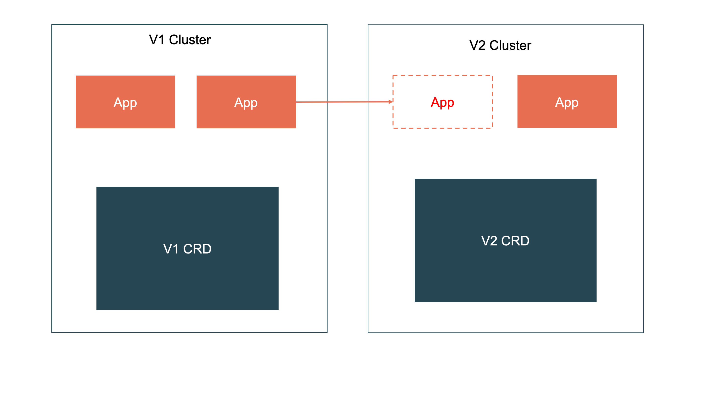
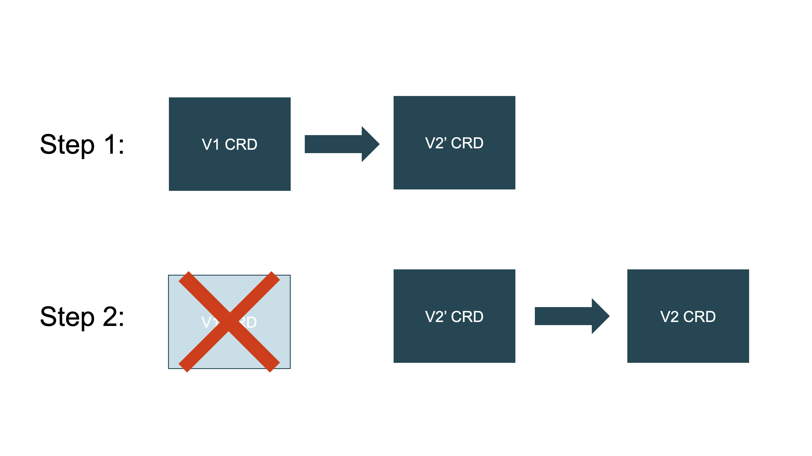

# Migration Solutions

In this doc we will talk about all solutions we have thought through to do CRD migration.
Note that OAM CRD migration is CRD migration with no exception. 

## 1. In-CLuster Migration

This is suggested in [upstream doc](https://kubernetes.io/docs/tasks/extend-kubernetes/custom-resources/custom-resource-definition-versioning/).
Basically, it relies on APIServer to do API routing between versions and custom conversion webhook to transform different schema between versions.

Here's a diagram depicting the entire workflow:

The workflow goes:

1. When CRD is upgraded to v1alpha2, the data is still stored as v1alpha1 format
2. Both v1alpha1 and v1alpha2 API endpoints are available. But reading v1alpha2 will trigger APIServerto read v1alpha1 data,
    and then conversion webhook will convert the data into v1alpha2 format to serve external world.
3. When writing data, regardless of using v1alpha1 or v1alpha2 API, it will be stored in v1alpha2 format.
    In such case, conversion webhook will be called again when converting v1alpha1 API to v1alpha2 format.
4. Note that the v1alpha1 -> v1alpha2 conversion is one direction -- after "upgrade" happens,
    further v1alpha1 reads will read v1alpha2 storage data.

Pros:
- This is supported by upstream
- Everything could be done within control plane and look transparent to users.

Cons:
- The conversion webhook needs to be written and provided by platform builders. There could be logical errors.
- Hard to roll back.
- No app-level granularity migration. It's one shot game for the entire cluster.

## 2. Separated Cluster Migration

Another solution is to use two clusters to hold different versions of CRD.
Similar to what's depicted in the following diagram:

Pros:
- This is cluster level upgrade, which has better isolution and safety control.

Cons:
- It requires the infrastructure architecture was designed to make clusters as cattle, not pets. If not, this is not viable.

## 3. Intermediate CRD Migration

The third solution borrows similar ideas from the second one but can still work within the same cluster.
It does a trick that creates an intermediate v2' CRD to hold migrated data while v2' doesn't belong to the same API Group as v1 and v2. This will allow two storage format to simultaneously exist and the migration could be done in a finer granularity like app-by-app migration.

The following diagram depicts the workflow:

